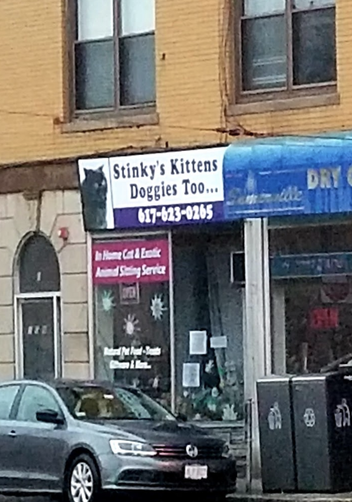

# Stinky's Kittens and Doggies too

## Scenario 🐈 🐕
You run a pet adoption agency called "Stinky's Kittens and Doggies too" (I guess this makes you Stinky!).  You need a 
way of keeping track of pets that are up for adoption as well as applicants for each pet, so that you can best match 
each pet with its fur-ever person.  

You've been in the pet adoption business for a while, and you know that if a person adopts one animal, they're likely
to be willing to adopt a second animal.  For this reason, you also want to keep track of successful applicants' contact
info so that you have the option of reaching out in the future if you have a particularly hard to market pet (see 
[Prancer's story](https://www.boredpanda.com/funny-honest-adoption-post-prancer/?utm_source=google&utm_medium=organic&utm_campaign=organic) for more info on what a "hard to market" pet looks like).

## Stories

### Stinky can see the names of the pets up for adoption (completed already ✅)
As Stinky, I want to know which pets I am trying to help get adopted.

**Given** there are pets available to adopt  
**When** I (Stinky) navigate to the application  
**Then** I see the name of each pet up for adoption

### Stinky can see some basic info about each pet
As Stinky, I want to know some basic info about the animals up for adoption 
so that I'm well-informed when talking to potential fur-parents.  In particular,
I'd like to know...
- the animal's age in years
- whether the animal is a cat or a dog, and
- whether the animal would prefer to be the only pet in a household

**Given** there are pets available to adopt  
  **When** I (Stinky) navigate to the application  
  **Then** I see the age, type (either cat or dog), and only-pet preference associated with each pet

### Stinky can add new pets up for adoption
New animals are constantly coming in the door looking for their fur-ever home!
As Stinky, I want to be able to add new pets to the list of pets up for adoption.

**When** I (Stinky) navigate to the application  
**And** I input a name, animal type, and only-pet preference
**And** I click "Add Pet"
**Then** I see the new pet and its info appear in the list.

### Stinky can add applicants for pets
As Stinky, I want to be able to document when someone applies to adopt a specific pet.
At the moment, the only things I need to know about applicants are their...
- name, and 
- which pet they are applying for

**When** I (Stinky) navigate to the application  
**Then** I see a form on the page for me to submit applicant information.

**When** I (Stinky) navigate to the application  
**And** I fill out the applicant information  
**And** I click "Add Applicant"  
**Then** I see the applicant's name listed alongside the selected pet's information.

**Given** A particular pet has applicants  
**When** I (Stinky) navigate to the application   
**Then** I see that pet's applicants' names included in the pet info

### Stinky can approve applicants (choose them as the adopter)
Stinky prides theirself on finding pets their fur-ever homes, which can only happen when an applicant
is approved to take home the pet.  As Stinky, I want to be able to approve an applicant for a pet, so that
pet can go to their new home.

**Given** A particular pet has applicants  
**When** I (Stinky) navigate to the application  
**Then** I see an "Approve" button next to each applicant's name

**Given** A particular pet has applicants  
**When** I (Stinky) navigate to the application  
**And** I click "Approve" on an applicant  
**Then** that pet is removed from the list of pets up for adoption.

### Applicant's that don't meet the pet's preference cannot be approved
Stinky is tired and frustrated.  Multiple pets are being returned to the adoption
agency because they do not get along with their adopter's already-owned pets.  As 
Stinky, I do not want to be able to grant approval for an adoption if the pet wants
to be an only-pet and the applicant already has pets at home.

**When** I (Stinky) navigate to the application  
**Then** I can specify number of pets already owned when adding a new applicant

**Given** A particular pet has applicants  
**When** I (Stinky) navigate to the application  
**Then** I see both each applicant's name **and** how many pets they own

**Given** A particular applicant already owns a pet  
**And** they pet they have applied for has a preference to be an only-pet  
**Then** I (Stinky) do not see an "Approve" button for that applicant

### Stinky knows who to spam with emails
As Stinky, I know that folks who adopt one animal are likely to be willing to adopt a second animal.
I want to have a way to reach out to previous adopters to try to increase adoptions. I would like to
record applicants' email addresses, and add the emails of approved applicants to a running list.

**When** I (Stinky) navigate to the application  
**Then** I can specify an email address when adding a new applicant

**Given** A pet has an eligible applicant  
**When** I (Stinky) approve that applicant  
**Then** I see the applicant's email address appear in a list labeled "e-list"

## Things to Note
- I have not provided you the same `yarn open` script in the journey test directory
that you are used to.  You will need to check out the `package.json` in the journey
directory to see how to run cypress, **and** you are responsible for making
sure the backend is running before starting up the cypress tests.
- Please don't call the phone number in the photo, it's probably not legal
for me to use this photo.